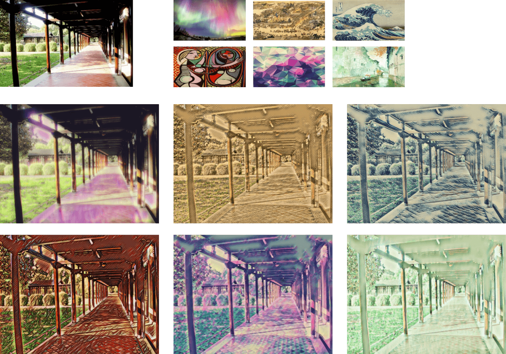
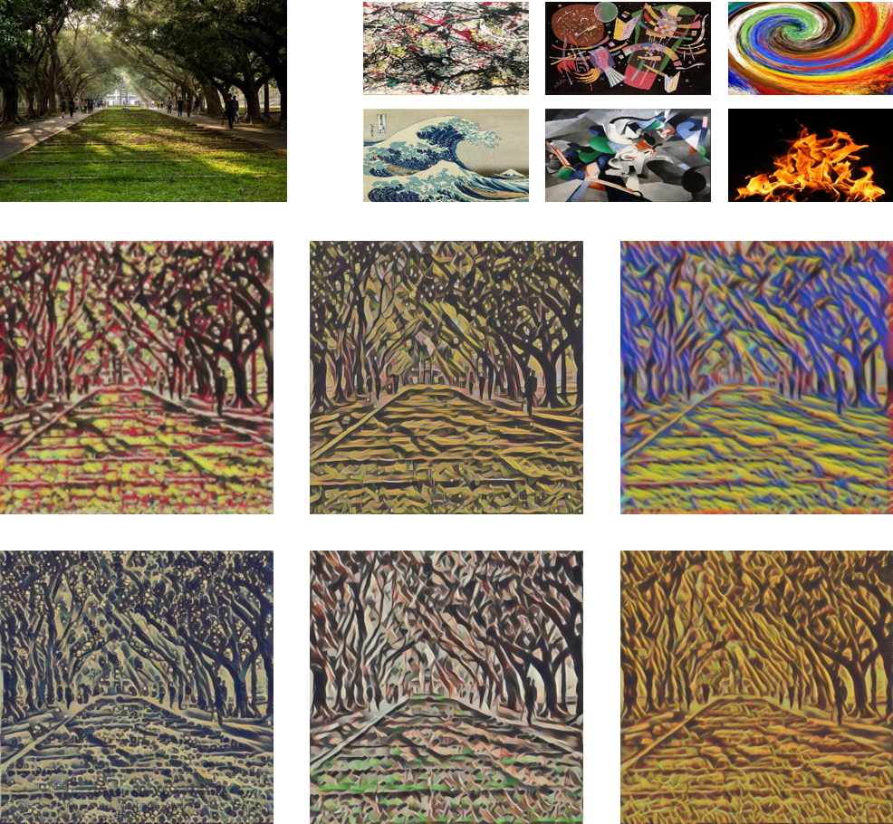
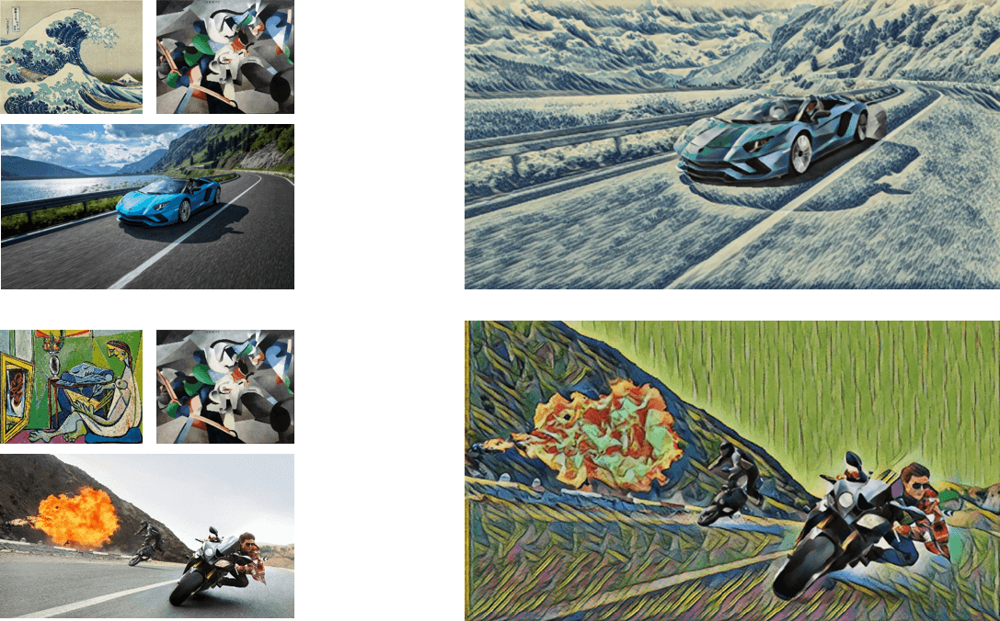

Tucana Neural Style in Keras
===============================

You can use this website to stylize image by several neural style transfer methods.

this project is implemented mainly in Keras(some part is Tensorflow)

Result
==============================

**Fast Neural Style**



**Style Swap**



**Mask Style**




Reference
===============================

**Fast Neural Style**

The fast neural style implementation is base on [fast-neural-style-keras](https://github.com/misgod/fast-neural-style-keras) by misgod, We made some changes to it, and this method is base on [Perceptual Losses for Real-Time Style Transfer and Super-Resolution](http://cs.stanford.edu/people/jcjohns/eccv16/) by Johnson et al.

In current version, We replace some of the Conv2D layer to Depth-wise separable convolutions in image transformation net. the detail of training procedures will be add soon. 

**Style Swap**

The style swap layer is reference from [WCT-TF](https://github.com/eridgd/WCT-TF) by eridgd, the original paper is [Fast Patch-based Style Transfer of Arbitrary Style](https://arxiv.org/abs/1612.04337) by Chen et al.

**Mask Style**

We use [Mask R-CNN](https://github.com/matterport/Mask_RCNN) which is implemented by [matterport](https://github.com/matterport), the original paper of Mask R-CNN is [Mask R-CNN](https://arxiv.org/abs/1703.06870) by He et al.

Our Environment
===============================

*  Python 3.5 (Anaconda)

*  CUDA 8.0 (For GPU support, if you want to train a model)
*  Cudnn 6.0 (For GPU support, if you want to train a model)

*  Flask 0.12.2
*  Keras 2.1.3
*  tensorflow-gpu 1.4
*  scipy 1.0.0
*  scikit-image
*  pycocotool
*  imgaug
*  cython

or directly use pip install the requirement txt file

```
pip install -r requirement.txt
```
You also need to meet the requirements of [Mask R-CNN](https://github.com/matterport/Mask_RCNN).

How to Use
==============================

Download the [distillated pretrained models](https://drive.google.com/open?id=12x2OX4AAuETgMRAxPWiRnPLoLPaRrXMu), and unzip the models into the **models/fast_style_transfer/pretrained**, then modify MODELS_PATH in "models/file_path.py", and use console move to the root project folder and type

```
python app.py
```

and open browser go to **localhost:5000**

How to train models
==============================

You have to download the [COCO dataset](http://cocodataset.org/#download) first, we use the training set of 2014(83K images).

**Fast Neural Style Original**

1. you need to fill the path string in **loss_net** function in **models/src/nets.py** to your [pretrained vgg16 model](https://github.com/fchollet/deep-learning-models/releases). Note that your training images should put in a folder like this **cocotrain/0/xxx.jpg** because we are using ImageDataGenerator to load the images, it assume that different classes of images are stored in the differnt folders.

2. prepare a style image and put it in **static/img/styles/**.

3. Type the command below to train a model. This is an example showing that if my training images are stored at the project root folder, and I want to train a style named mosaic.

```
python train_fast_model.py -p ./cocotrain -s mosaic
```

You can also tune the weight of content and style , type -h to see all the arguments.

```
python train_fast_model.py -h
```

**Fast Neural Style Distillated**

Working... (❍ᴥ❍ʋ)